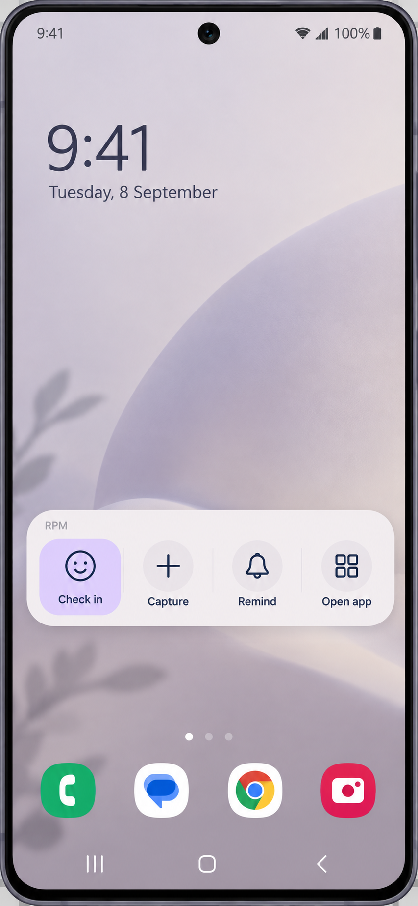
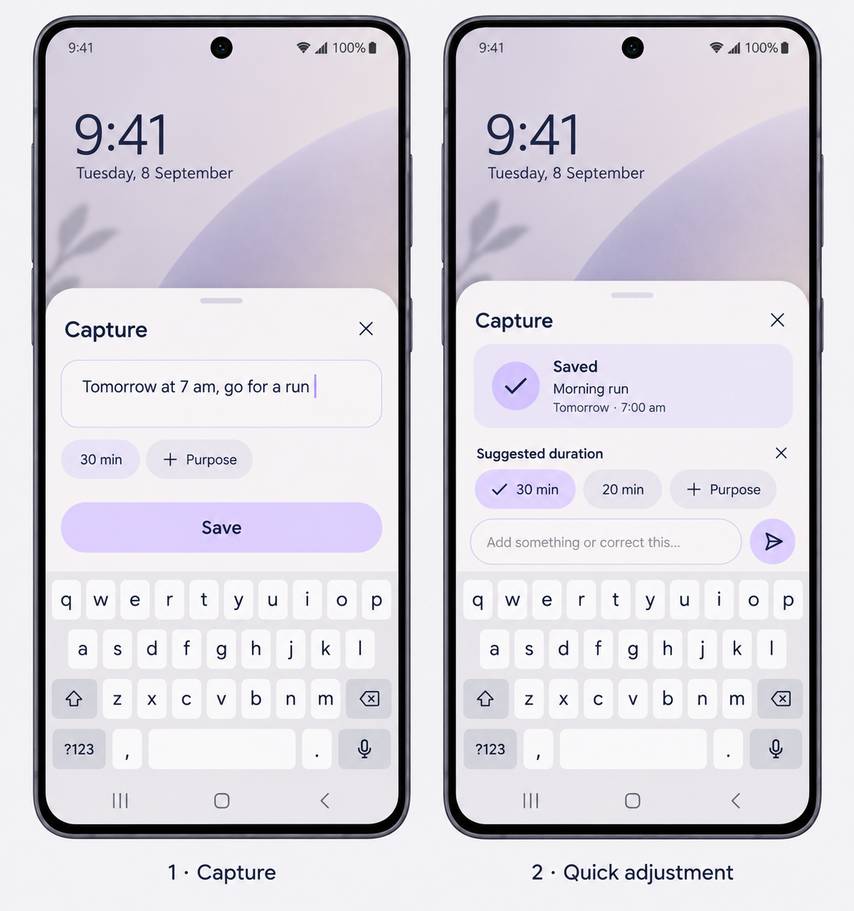

# RPM: product context and decisions

## Current direction: refine the CLI before an app

The user rejected the app workflow and explicitly asked to set the app aside, rebuild the workflow in a CLI, refine it there, and only then return to an app. Native UI iteration is paused. The CLI uses separate local data and previews reminder conversations without claiming to schedule an actual alarm. This supersedes the current app delivery milestones below.

Saved 8 September 2026 from the approved design conversation. Source task: `01a0805f-138b-72d1-8a19-3616014f0209`. This is a durable discussion summary, not a claim that everything below is already implemented. See the README and testing notes for actual delivery status.

## Updated scope: Convex, reminders and alarms

Later on 8 September, during implementation, the user explicitly requested **Convex to collect the app's data automatically**, explaining that repeatedly connecting the phone is a hassle. This supersedes the original local-only/cloud-deferred delivery scope below. Keep SQLite for instant offline saves, then automatically upload authenticated changes to the user's Convex deployment when connectivity returns. Phone pairing should be a one-time setup, not a recurring cable/export chore. Original captures, check-ins, revisions, results and scheduling records belong in that data stream; incomplete drafts do not upload until saved.

The same change request explicitly requires both **notification reminders and ringing alarms now**. Keep these types distinct, confirm the selected date/time, request the Android permissions appropriate to each, and verify actual behavior. Alarms must run locally, independent of Convex/internet. Delivery under Samsung-specific battery settings still requires a real-device check.

The user also requested an emulator download and S24 screen testing. Use a 1080 × 2340 stock Android profile matching S24 FE resolution, while clearly distinguishing it from Samsung One UI. The user later asked to stop sending progress reports to other tasks; continue work and updates here only.

## Why this app exists

The user has tried roughly 20–30 life-planning systems, including gamified Google Sheets with points, skills and levels, and at least seven pure Tony Robbins RPM web, desktop or APK variants. Motivation initially rises, then the work of maintaining the system defeats use. Fantasy categories did not fit the user's multiple real-life domains. Another elaborate planner would repeat that failure.

RPM thinking remains valuable: What result do I want? Why does it matter emotionally? What actions could move it forward? Repeatedly writing why/how and assigning every thought to a goal, project or RPM block is the friction to remove. Purposes should be reusable, capture should be almost effortless, and unfiled thoughts are legitimate. Deep context belongs behind simple everyday execution. No points, streak guilt, compulsory hierarchy, or catch-up after gaps.

## Approved visual references

The user explicitly loves both previews. Preserve lavender, warm white, dark navy, rounded surfaces and generous space. More stylistic icons can follow later. These are visual references, not screenshots of implemented behavior.

The horizontal widget gives prominent lavender **Check in**, then **Capture**, quieter **Remind**, and **Open app**. Capture should feel like a light rounded sheet above the keyboard, with the home background visible when launched from the widget. Do not build a fake keyboard: use the system text input and its dictation button.

## First offline build

Target device: Samsung Galaxy S24 FE. One primary mobile interface; no paid realtime AI requirement and no cloud dependency for the core. Prioritize two capture flows, immediate durable saving, simple explicit correction and useful recent history. The full app should provide deeper result/purpose/action context, optional grouping, history and modest progress views without making them prerequisites for capture.

### Capture a planned action

Text such as “Tomorrow at 7 am, go for a run” is sufficient. Optional chips include “30 min” and “+ Purpose”. Save original raw information immediately, clear the input, and retain a compact latest-entry card. Clearing the textbox does not delete the record. Keep the input ready for another thought.

Use deterministic local interpretation for supported dates, times and durations. Preserve unsupported input and let the user edit it; do not pretend a local parser has general AI understanding. A missing duration defaults to a clearly labeled **30-minute estimate**, never measured time. Eventually estimates may learn from choices. Suggestions must visibly require acceptance; a checkmark must not imply an unaccepted suggestion is accepted.

“Actually, twenty” can correct duration only with an explicit visible target: the latest entry in this capture session. Confirm the intended update before applying it. Unrelated input must remain a new capture, and ambiguous corrections must not silently change old entries. Retain revision history and original text. Purpose and project/group are optional.

### Check in about actual activity

Record what the user reports doing with an automatic timestamp, optional mood/energy, notes and reported actual duration. Keep planned actions distinct from reported events, and estimated duration distinct from reported actual duration. Mood must be selected, never inferred or fabricated. Missing logs are not inactivity. Sparse records are useful; there is no requirement to document a complete day or repair a backlog after four days away.

Mood tracking has been useful to this user before. Show history and next actions that help now. Any later associations are questions to explore, not causal verdicts about what helps or drains them.

### Reminders and alarms

Offer simple local reminders where Android permissions and scheduling permit. Confirm type and time. A notification reminder is different from a ringing alarm; never label a notification as a guaranteed alarm. Android permissions, battery policy, force-stop, reboot and device behavior need explicit testing. Calendar and notification integration were not previously verified. Do not claim guaranteed delivery.

Keyboard dictation relies on the installed keyboard, speech engine, downloaded languages and device settings. Offline dictation is unverified. No custom voice recorder, live voice agent or TTS is required for this build.

## Existing reflection workflow stays

A separate recorder already uploads long voice recordings to Google Drive. Preserve it alongside this app: “one interface” does not mean removing the user's working reflection process. Future online ingestion could transcribe/summarize reflections into context. No Drive connection, credentials or access is authorized for this first implementation. Reflections remain reflections; exploratory ideas are not automatically commitments, tasks or priorities. Possible actions should be suggestions only.

## Future learning, deliberately outside the first slice

Learn from choices and corrections, priorities, schedules, actual time, mood and reflections, without a separate training chore. The user wants contextual understanding beyond frequency rules. Habits do not define aspirations. Suggested sorting, timing, durations and purposes should be easy to correct and explain with evidence.

An occasional Codex review every few days or when useful could inspect friction, form hypotheses, propose small app changes and assess whether effort fell. This is optional, not a mandatory daily review. Preserve familiar UI rather than constantly rearranging it. No recurring automation is to be created now.

## Alternatives rejected or deferred

- WhatsApp was initially desired and then explicitly dropped.
- Telegram buttons were explored; a dedicated app was preferred for responsiveness and control.
- Multiple web/desktop entry points are deferred in favor of the mobile experience.
- Realtime conversational voice is deferred for ongoing cost and latency concerns. Earlier spoken price ranges were illustrative, unmeasured allowances, not a verified budget.
- Google Calendar is a future integration, not an offline-core dependency.
- Gamification, required classification, repeated purpose writing, exhaustive logging and unstable adaptive layouts conflict with the central constraint.

## Conceptual second opinions and success criteria

Astra's second opinions supported the revised split between keyboard dictation and long reflection. Immediate saving builds trust. Main risks remain: checking AI guesses replaces form filling; mood/activity recording becomes a new obligation; UI changes erode familiarity; and collecting data only for future insight supplies no immediate reward.

Judge the first slice on reduced remembering and deciding, easy return after gaps, and usefulness on low-motivation days—not number of logs, streaks, or perfect completeness. Test it on the real phone before expanding it.

## Research pointers from the conversation

These references were supplied as design context. They are not evidence that RPM or this particular app works; this brief does not independently verify their findings.

- Cue-action planning: https://doi.org/10.1016/S0065-2601%2806%2938002-1
- Progress monitoring and attainment: https://pubmed.ncbi.nlm.nih.gov/26479070/ (does not establish that maximal detail is better).
- Habit formation in consistent contexts: https://doi.org/10.1002/ejsp.674 (an isolated miss is not a moral failure or reset).
- Tracking burden and usefulness: https://www.sciencedirect.com/science/article/pii/S107158191630060X
- Abandonment can indicate low value or having learned enough: https://escholarship.org/uc/item/0655n3p4

## Milestones and open questions

1. Preserve this brief and approved images; inspect the existing prototype without destroying it.
2. Implement local persistence, Capture and Check in, simple correction, recent history, and the home widget.
3. Add modest optional RPM context and honest local reminder support; build an installable debug APK and run meaningful checks.
4. Validate on Galaxy S24 FE: keyboard/sheet behavior, widget sizing, save/reopen, notification permissions and delivery, reboot recovery, low-motivation use and return after gaps.
5. Only after use, consider reflection ingestion, contextual learning, calendar and periodic review.

Open questions include which few fields genuinely help in daily use, which phrases the user naturally dictates, useful estimate defaults per activity, reminder reliability under Samsung power policies, and whether occasional learning reviews reduce effort. Device installation and offline speech support remain unverified until tested. Make reversible implementation choices without repeatedly seeking approval, but do not turn future integrations into assumed authorization.
